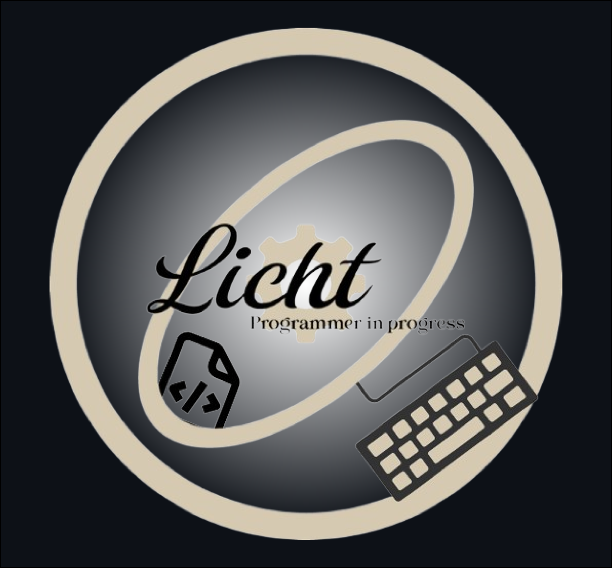

<!-- LOGO -->

  

<!-- TITLE -->
<h1 align="center">Hi 👋, I'm Sebastian Airthon Gonzales Aroni</h1>
<h3 align="center">Software Engineering Student | Passionate about Web Development and Backend</h3>

<!-- CONNECT -->

<h3 align="center">🌐 Connect with me:</h3>

  
  

<!-- LANGUAGES AND TOOLS -->

<h3 align="center">🛠 Languages and Tools:</h3>

  
  
  
  
  
  
  
  
  

<!-- GITHUB STATS -->

<h3 align="center">📊 My GitHub Stats:</h3>

  

  

<!-- TROPHIES -->

<h3 align="center">🏆 GitHub Trophies</h3>

  

